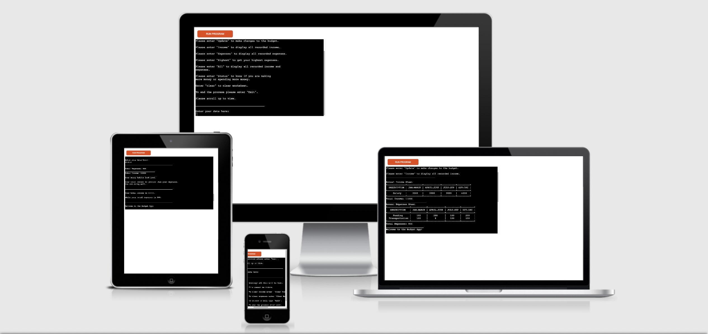

# BUDGET APP
Budget App is a Python terminal app that runs in the Code Institute mock terminal on Heroku. 
The budget app was created to help users keep track of their finances quarter-yearly. 
Users are able to organise their money  into a separate annual income and expenses sheet so they can see where and how much is spent.
Users are able to find out the highest expenses for the year and get the net income or expense.
 
* [Here is link to the live version of my project.](https://annual-budget-app.herokuapp.com/)
* [Here is link to the spreadsheet.](https://docs.google.com/spreadsheets/d/1AISmadvUDGeb7F3gWocdoafF-R7RSH8TGHxi1TEv0KI/edit#gid=1259008555)

# FINAL DESIGN

# Existing Features
## Welcome and Menu Page
* Featured on this page is the main menu giving guidelines on how to use the app.
* The user has options to update the budget, view all previously recorded income or expenses and exit the app. 

## Update Page
* After typing “Update”, the user is given the option to update income, update expenses or return to the main page.
* If the user chooses to update income, the annual income sheet and total income appears. Beneath it, the user is given detailed guidelines on how to update a single/entire row and column. The user then has to type “New Row” to validate the input. There is also an option to exit or return to the main page. 
* To update expenses, the user is put through similar process as above. 
* A validation message is shown to prompt the user to enter correct values if the user enters any value less than 2 or greater than 5 rows. 

## Income Page
* The Annual Income Sheet and total income appears.

## Expenses Page
* The Annual Expenses Sheet and total expenses appears.

## Highest Page
* Shows the total expenses and highest expenses. Helps the user know what he is spending mostly on.

## All Page
* Shows the Annual Income Sheet and total income along with the Annual Expenses Sheet and total expenses.

 
## Status Page
* The total income in deducted from the total expenses.
* The user is informed if the total income is greater than the total expenses, the total expenses is greater than the total income or if the total income and expense are equal. 

## Clear Page
* The user is shown a warning message saying all data will be lost and this cannot be undone. The user can clear income, clear expenses, exit or return to the main page.
* If the user chooses to clear income, the annual income sheet is returned empty with all data except the header deleted. 
* If the user chooses to clear expenses, the annual expenses sheet is returned empty with all data except the header deleted.

# Testing
I have manually tested the project by doing the following:
* Passed the code through a PEP8 linter and confirmed there are no problems. 
* Tested in my local terminal and the Code Institute Heroku terminal. 
* Continuous testing during the app development by using print statements for individual functions. Validation messages are displayed when the user enters a wrong input. 

# Validator Testing
* PEP8
  * No errors were returned from PEP8online.com. 

# Solved Bugs
* I got errors stating to consider using enumerate instead of iterating with range and len, which was fixed accordingly. 
* Error message returns when user inputs worksheet values less than two or greater than five. Validated code to ensure user is prompted to enter correct input. 
* Error message returns when user enters a command in upper case. Validated code to ensure both uppercase and lower case can be used. 

# Technology used
* Python - the language in which the game is written.
* Github - version control.
* Heroku - platform which the app was deployed.
* Am I Responsive - [Am I Responsive](http://ami.responsivedesign.is/?url=https%3A%2F%2Fannual-budget-app.herokuapp.com%2F#) was used to create the images in the Final Design section.

# Libraries/Modules:
  * os - This module provides a portable way of using operating system dependent functionality.
  * PrettyTable - Python library used to represent data in tables. 
  * Gspread - Python API for Google Sheets.
  * Google Auth - allows access to Google Cloud safely through a method called Credentials.
  

# Deployment
The project was deployed using Code Institute’s mock terminal for Heroku.  
* Steps for deployment:
    * Fork or clone this repository.
    * Create a new Heroku app.
    * Set the build backs to Python and NodeJS in that order.
    * Link the Heroku app to the repository.
    * Click on Deploy Branch. 

# Credits and Acknowledgements 
* Code Institute for the deployment terminal. 
* I would like to thank [AbdulFattah Badara](https://github.com/fobadara) and my Code Institute mentor, [Anthony Ugwu](https://github.com/tonyguesswho) for all their support, encouragement and corrections. 

